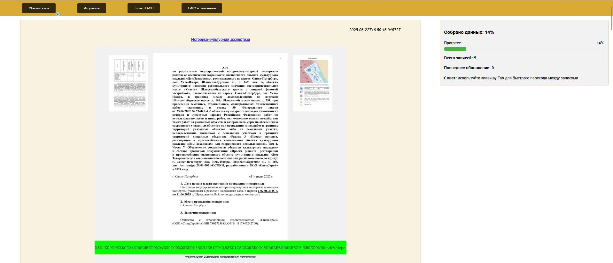

# VKPMONBOT: Система мониторинга градостройтельной документации Петербурга




**VKPMONBOT** — система для автоматического мониторинга градостроительной документации Санкт-Петербурга. Проверяет:
- Разрешения на строительство и ввод в эксплуатацию (с построением карт на основе OpenStreetMap)
- Градпланы (также с картами)
- Согласования архитектурно-градостроительного облика 
- Историко-культурные экспертизы (анализ PDF-файлов с генерацией кратких выдержек, эскизов и миниатюр)

Результаты доступны через веб-дашборд и Telegram-бота.

## 📌 Возможности
- Автоматический сбор данных (каждые 30 минут)
- Визуализация данных на карте (OpenStreetMap)
- Анализ многостраничных PDF (историко-культурные экспертизы)
- Гибкая система подписок через Telegram
- Веб-интерфейс для просмотра данных

## ⚙️ Установка и настройка

### Предварительные требования
- Python 3.x
- Аккаунт Telegram (для создания бота через @BotFather)

### 1. Клонирование репозитория
```bash
git clone https://github.com/alfablend/vkpmonbot/vkpmonbot.git
cd vkpmonbot
```

### 2. Настройка конфигурации

A. Файл пользователей Telegram (users_tg.json)
Создайте файл и добавьте пользователей для рассылки. Пример:
```json
[
    {
        "user_id": 123456789,
        "username": "USERNAME",
        "type": ["gike", "gasn"]
    }
]
```

Где:

    gike — подписка на историко-культурные экспертизы
    gasn — подписка на разрешения на строительство

B. Токен Telegram-бота (token.txt)
Получите токен у @BotFather и сохраните его в файл.

### 3. Установка зависимостей

```bash
pip install -r requirements.txt
```

### 🚀 Запуск системы

    Основной модуль сбора данных:

```bash
python vkp.py
```

    Telegram-бот для управления подписками:

```bash
python telegram-bot.py
```
### 🌐 Использование

    Веб-интерфейс: Доступен по адресу http://127.0.0.1:23336

    Telegram-бот: Отправьте /start вашему боту для управления подписками

    Принудительное обновление:

```bash
curl 127.0.0.1:23336/restart
```
### 🛠 Технологический стек

    Backend: Python (Flask)

    Парсинг: BeautifulSoup, PyPDF

    Геоданные: rosreestr2coord, OpenStreetMap

    Telegram API: telebot

### ⚠️ Ограничения

    Проект находится в стадии активной разработки

    Только для образовательных целей

    Данные могут быть неполными или содержать ошибки.